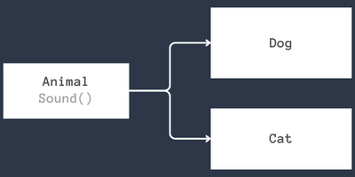
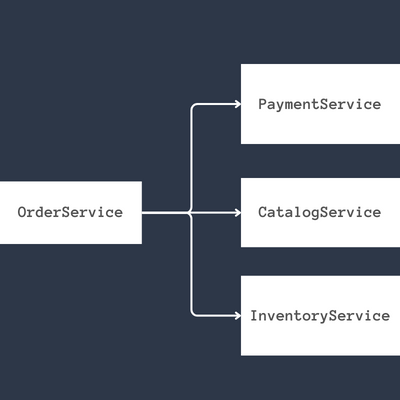

## Introduction

Golang interfaces are an important aspect of the Go programming language as they allow for flexibility and modularity in code. By defining a set of methods that a type must implement, interfaces enable different types to be used interchangeably. However, excessive use of interfaces can make an application harder to understand and maintain. This section provides an overview of the basic and advanced features of Golang interfaces, offering guidance on common mistakes to avoid and gotchas to watch out for. Additionally, it provides tips and tricks for effective usage, as well as code examples and further reading resources. The article covers a comprehensive range of topics, from foundational knowledge to more advanced aspects of Golang interfaces, guiding readers through the entire spectrum of understanding and application.

## What is an Interface?

A Golang interface is a type that specifies a set of method signatures, defining a contract that other types must fulfil. Any type that implements all the methods in the interface is said to satisfy that interface, regardless of the underlying implementation. Interfaces in Golang enable flexibility, allowing different types to be treated uniformly based on shared behaviour, thus facilitating polymorphism and clean code design.

For example, in the diagram below, we define an interface `Animal` that has a method `Sound()`. Any animal that can make a `Sound()` will fulfil the interface.




The following is an implementation of the `Animal` interface with two concrete structs, `Dog` and `Cat`, that fulfil the `Animal` interface.

```go
package main

import (
	"fmt"
)

type Animal interface {
	Sound()
}

type Dog struct{}

func (Dog) Sound() {
	fmt.Println("bark...")
}

type Bird struct{}

func (Bird) Sound() {
	fmt.Println("chirp...")
}

func main() {
	var animals = []Animal{Dog{}, Bird{}}
	for _, a := range animals {
		a.Sound()
	}
}
```

Interfaces can be composed, meaning that you can create a new interface by embedding one or more existing interfaces. This allows you to combine multiple behaviours into a single interface, promoting code reusability and clean design. By composing interfaces, you can create more complex and expressive type relationships, and avoid redundancy in your code. If a type implements all the methods of the composed interfaces, it is said to satisfy the composite interface. This powerful feature contributes to Golang's flexibility and expressiveness in designing clean and maintainable code.

Let's create another interface named `Mover` that has a method `Move`, and create a new composite interface called `Creature` that includes both the `Animal` and `Mover` interfaces.

```go
package main

import (
	"fmt"
)

type Animal interface {
	Sound()
}

type Mover interface {
	Move() 
}

type Creature interface {
	Animal
	Mover	
}


type Dog struct{}

func (Dog) Sound() {
	fmt.Println("bark")
}

func (Dog) Move() {
	fmt.Println("run")
}

type Bird struct{}

func (Bird) Sound() {
	fmt.Println("chirp")
}

func (Bird) Fly() {
	fmt.Println("fly")
}


func main() {
	var animals = []Animal{Dog{}, Bird{}}
	for _, a := range animals {
		a.Sound()
		a.Move()
	}
}
```

## Real world use cases

The given code defines a real-world use case for processing an order in a microservices architecture. It includes interfaces for Payment, Inventory, and Shipping services, encapsulating the functionalities required for each step. The `OrderProcessingService` struct integrates these services to process an order, managing payment, reserving inventory, and scheduling shipping, demonstrating how microservices can be composed to handle complex business logic.




```go
type PaymentService interface {
    ProcessPayment(order Order) (paymentConfirmation string, err error)
}

type InventoryService interface {
    ReserveItems(order Order) error
    ReleaseItems(order Order) error
}

type ShippingService interface {
    ScheduleShipping(order Order) (shippingTracking string, err error)
}

type OrderProcessingService struct {
    paymentService  PaymentService
    inventoryService InventoryService
    shippingService ShippingService
}

type OrderConfirmation struct {
		PaymentConfirmation string
		ShippingTracking string
}

func (ops OrderProcessingService) ProcessOrder(order Order) (*OrderConfirmation, error) {
    // Reserve inventory items for the order
    err = rops.inventoryService.ReserveItems(order)
    if err != nil {
        return "", err
    }

    // Process payment for the order
    paymentConfirmation, err := rops.paymentService.ProcessPayment(order)
    if err != nil {
        _ = rops.inventoryService.ReleaseItems(order)
        return "", err
    }

    // Schedule shipping for the order
    shippingTracking, err := rops.shippingService.ScheduleShipping(order)
    if err != nil {
        return orderConfirmation, err
    }

    orderConfirmation = &OrderConfirmation{
        PaymentConfirmation: paymentConfirmation,
        ShippingTracking:    shippingTracking,
    }

    return orderConfirmation, nil
}
```

- `PaymentService`: Handles payment processing for an order, returning a confirmation string if successful.
- `InventoryService`: Manages inventory reservations and releases for specific orders.
- `ShippingService`: Schedules shipping for an order, providing a tracking string for shipment tracking.
- `OrderProcessingService`: Coordinates between payment, inventory, and shipping services to process an order, handling failures and successes in each step.
- `OrderConfirmation`: Encapsulates the details of a successful order, including payment confirmation and shipping tracking information.

These service interfaces and structures define clear contracts and responsibilities within the order processing flow, promoting modularity and maintainability.

## Some core interfaces

Golang's core interfaces are an essential part of the language, providing standard method signatures that facilitate a wide variety of common programming tasks. From reading and writing data to error handling, sorting, and handling HTTP requests, these interfaces create a flexible and consistent way to manage these operations across different types.

By defining common functionalities through interfaces, Go promotes code reusability, maintainability, and a clean, idiomatic design. The standard library offers a collection of well-known core interfaces that developers will often encounter and leverage in their code. Whether you're working with files, networking, or custom data structures, understanding these core interfaces can significantly enhance your coding efficiency and the quality of your software.

### io.Reader

Represents the read operation; any type that implements a `Read(p []byte) (n int, err error)` method satisfies this interface.

```go
r := strings.NewReader("This is an example of io.Reader in Go")

// My custom MyReader that implements io.Reader
type MyReader struct {
	data []byte
	pos  int
}

func (r *MyReader) Read(p []byte) (n int, err error) {
	if r.pos >= len(r.data) {
		return 0, io.EOF
	}

	n = copy(p, r.data[r.pos:])
	r.pos += n
	return n, nil
}
```

### io.Writer

Represents the write operation; any type that implements a `Write(p []byte) (n int, err error)` method satisfies this interface.

```go
package main

import (
	"fmt"
	"io"
)

type MyWriter struct {
	data []byte
}

func (w *MyWriter) Write(p []byte) (n int, err error) {
	w.data = append(w.data, p...)
	return len(p), nil
}

func (w *MyWriter) String() string {
	return string(w.data)
}

func main() {
	w := &MyWriter{}
	io.WriteString(w, "Custom io.Writer in Go")
	fmt.Println(w.String()) // Output: Custom io.Writer in Go
}
```

### io.ReadWriter

Combines `io.Reader` and `io.Writer`, requiring both read and write methods.

```go
package main

import (
	"fmt"
	"io"
)

type MyReadWriter struct {
	data []byte
	pos  int
}

func (rw *MyReadWriter) Read(p []byte) (n int, err error) {
	if rw.pos >= len(rw.data) {
		return 0, io.EOF
	}

	n = copy(p, rw.data[rw.pos:])
	rw.pos += n
	return n, nil
}

func (rw *MyReadWriter) Write(p []byte) (n int, err error) {
	rw.data = append(rw.data, p...)
	return len(p), nil
}

func main() {
	rw := &MyReadWriter{}
	io.WriteString(rw, "Custom io.ReadWriter in Go")

	buf := make([]byte, 16)
	for {
		n, err := rw.Read(buf)
		if err == io.EOF {
			break
		}
		fmt.Print(string(buf[:n]))
	}
}
```

### error

The built-in interface for error handling, with a method signature of `Error()` string.

```go
package main

import (
	"fmt"
)

type MyError struct {
	message string
}

func (e *MyError) Error() string {
	return e.message
}

func someFunction() error {
	return &MyError{message: "Something went wrong!"}
}

func main() {
	err := someFunction()
	if err != nil {
		fmt.Println(err) // Output: Something went wrong!
	}
}
```

### fmt.Stringer

Used for string representation, requires the method String() string, and is automatically called by the fmt package when printing.

```go
package main

import (
	"fmt"
)

type MyType struct {
	Value int
}

// Implementing the String method for MyType
func (m *MyType) String() string {
	return fmt.Sprintf("MyType with Value: %d", m.Value)
}

func main() {
	val := &MyType{Value: 42}
	fmt.Println(val) // Output: MyType with Value: 42
}
```

### sort.Interface

Used for sorting slices, requires the methods `Len() int`, `Less(i, j int) bool`, and `Swap(i, j int)`.

```go
package main

import (
	"fmt"
	"sort"
)

type MyTypeSlice []MyType

type MyType struct {
	Value int
}

func (m MyTypeSlice) Len() int {
	return len(m)
}

func (m MyTypeSlice) Less(i, j int) bool {
	return m[i].Value < m[j].Value
}

func (m MyTypeSlice) Swap(i, j int) {
	m[i], m[j] = m[j], m[i]
}

func main() {
	values := MyTypeSlice{
		{Value: 42},
		{Value: 7},
		{Value: 13},
	}

	sort.Sort(values)

	for _, v := range values {
		fmt.Println(v.Value)
	}
}
```

### http.Handler

Used in web development, it requires the method `ServeHTTP(ResponseWriter, *Request)`, allowing a type to respond to HTTP requests.

```go
package main

import (
	"fmt"
	"net/http"
)

type MyHandler struct{}

func (m *MyHandler) ServeHTTP(w http.ResponseWriter, r *http.Request) {
	fmt.Fprint(w, "Hello from MyHandler!")
}

func main() {
	handler := &MyHandler{}
	http.Handle("/", handler)

	fmt.Println("Starting server at :8080")
	if err := http.ListenAndServe(":8080", nil); err != nil {
		fmt.Println("Server error:", err)
	}
}
```

In this code, the `MyHandler` type implements the `http.Handler` interface by defining the `ServeHTTP` method. When you run this code and navigate to http://localhost:8080 in a web browser, you'll see the message "Hello from MyHandler!" displayed.


## Other usages

### Empty Interface (`interface{}` or `any`)

```go
func PrintValue(value any) {
    fmt.Printf("Value: %v\n", value)
}

// From Go 1.18, you can use any instead of interface{}
func PrintValue(value any) {
    fmt.Printf("Value: %v\n", value)
}
```

The empty interface can represent any type, and it's often used when you want to handle multiple types dynamically.

### Type switches

You can use a type switch to identify the dynamic type of an interface value and handle each type differently.

```go
func Describe(i interface{}) {
    switch v := i.(type) {
    case int:
        fmt.Printf("Integer: %v\n", v)
    case string:
        fmt.Printf("String: %v\n", v)
    default:
        fmt.Printf("Unknown type %T\n", v)
    }
}
```

### Type Assertions

A type assertion provides access to an interface value's underlying concrete value. It can be used to extract the specific type from an interface.

```go
var myInterface interface{} = "Hello, World!"
str := myInterface.(string) // Type assertion
```

### Embedding Interfaces

```go
type ReaderWriterCloser interface {
    io.Reader
    io.Writer
    io.Closer
}
```

## Gotchas in working with interfaces

### Passing interface, return construct

By returning a concrete type, you make it clear what the function is returning, which makes the API easier to understand and use.

```go
// Preferred
func NewBook(title string) *Book {
    return &Book{Title: title}
}

// Less Clear
interface Reader {
    Read() string
}
func NewReader(title string) Reader {
    return &Book{Title: title}
}
```

If the caller wants an interface, they can define what they need. Returning a concrete type doesn't lock the caller into a particular interface.

```go
type Writer interface {
    Write(string)
}

func NewLogger() *Logger {
    return &Logger{}
}

var w Writer = NewLogger() // Caller decides to use the Writer interface
```

### Avoid interfaces pollution

Avoiding interface pollution promotes clean and maintainable code by adhering to the principle of defining small and focused interfaces. By creating interfaces with only the methods that are strictly necessary, you reduce coupling between packages and make it easier to understand and change the code. This encourages more modular, reusable, and testable code

```go
// Polluted interface with too many responsibilities
type FileHandler interface {
	Open(path string) error
	Close() error
	Read(p []byte) (n int, err error)
	Write(p []byte) (n int, err error)
	Delete(path string) error
}
// A concrete type implementing the large interface
type MyFileHandler struct{}

func (m *MyFileHandler) Open(path string) error   { /* Implementation */ return nil }
func (m *MyFileHandler) Close() error             { /* Implementation */ return nil }
func (m *MyFileHandler) Read(p []byte) (n int, err error) { /* Implementation */ return 0, nil }
func (m *MyFileHandler) Write(p []byte) (n int, err error) { /* Implementation */ return 0, nil }
func (m *MyFileHandler) Delete(path string) error { /* Implementation */ return nil }
```

Now, suppose we want to introduce a read-only file handler. With the above polluted interface, even a read-only implementation must provide all the methods, leading to unnecessary complexity.

We can avoid this by breaking down the interface:

```go
type FileReader interface {
	Open(path string) error
	Close() error
	Read(p []byte) (n int, err error)
}

type FileWriter interface {
	Open(path string) error
	Close() error
	Write(p []byte) (n int, err error)
}

type FileDeleter interface {
	Delete(path string) error
}

// Read-only implementation
type MyReadOnlyFileHandler struct{}

func (m *MyReadOnlyFileHandler) Open(path string) error   { /* Implementation */ return nil }
func (m *MyReadOnlyFileHandler) Close() error             { /* Implementation */ return nil }
func (m *MyReadOnlyFileHandler) Read(p []byte) (n int, err error) { /* Implementation */ return 0, nil }
```

By splitting the interface into smaller parts, we can implement only the necessary methods for the read-only file handler, avoiding the interface pollution problem.

## Conclusion 

Golang interfaces offer a powerful and flexible means to achieve clean and modular code design. By defining method signatures that types must fulfil, they allow different types to be used interchangeably, fostering polymorphism, reusability, and maintainability. 

The ability to compose interfaces enables developers to create complex relationships and avoid redundancy, while the core interfaces in the standard library streamline common programming tasks. Though their overuse can add complexity, a careful and informed application of interfaces enhances code quality, making them an indispensable tool in the Golang developer's toolkit. 
